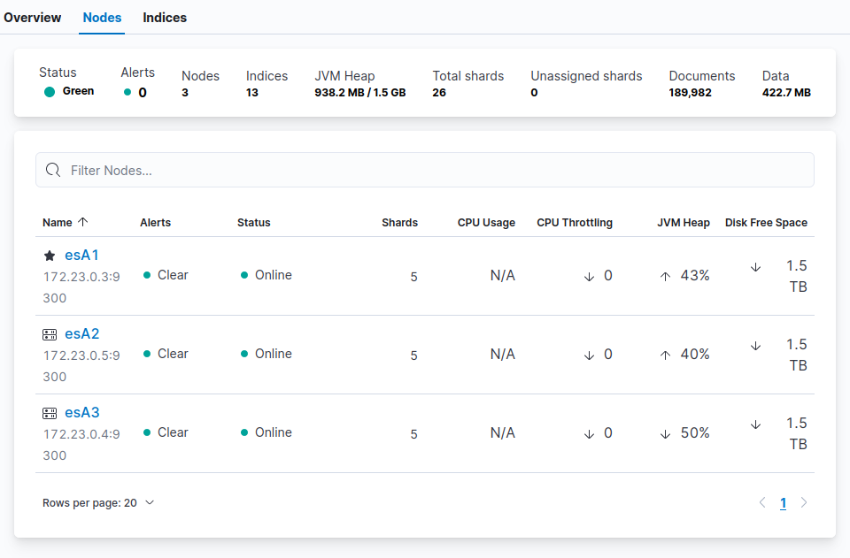
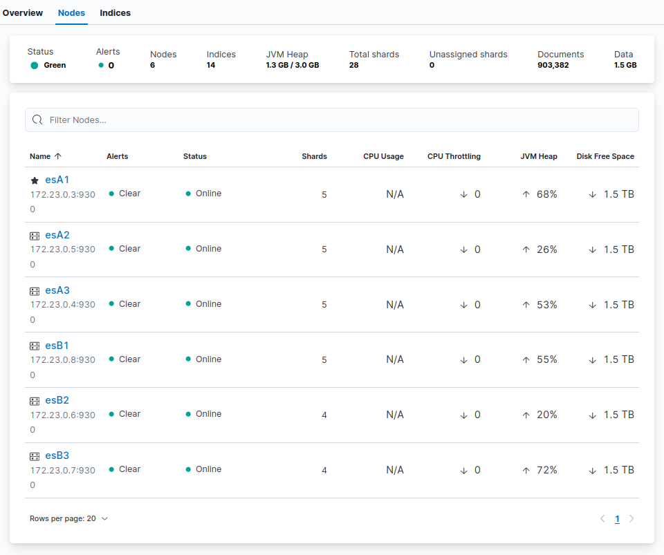
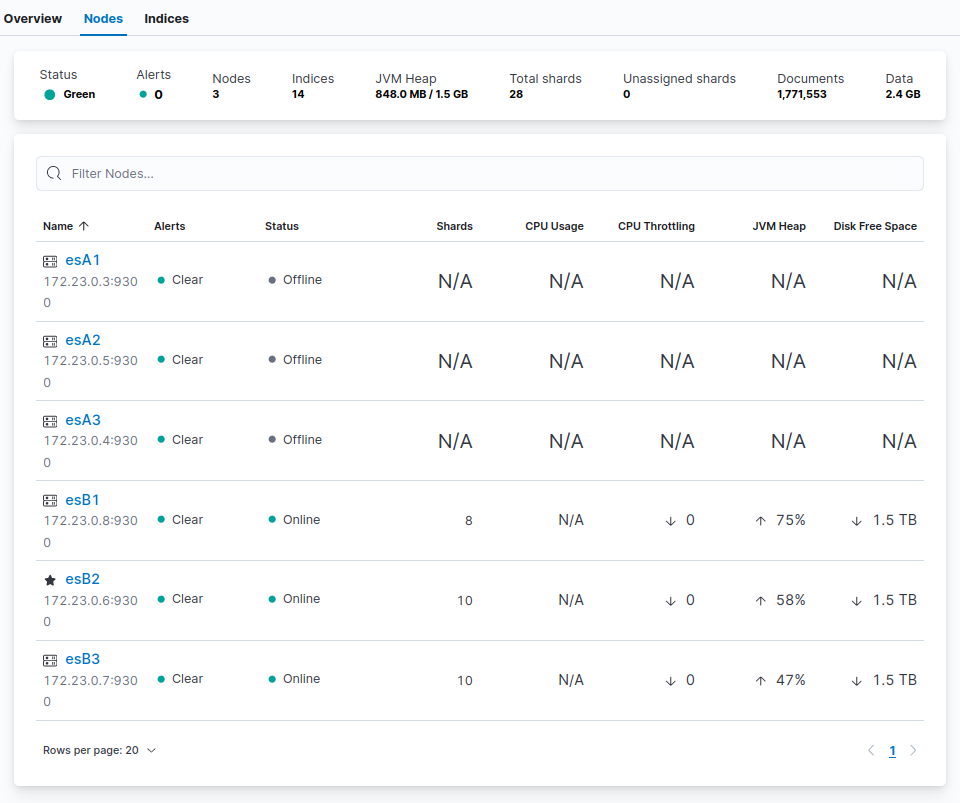

# Elasticsearch migration tutorial

The companion repo to my blogpost on migrating an Elasticsearch cluster without service disruption.


We'll simplify the infrastructure of this sample project so not configuring any kind of serious security (pre-configured SSL only). Use these credentials :

- Username : elastic
- Password : changeme

## Setting up Cluster A

Consider Cluster A as the cluster you want to migrate the data from, to Cluster B. We're going to start one and generate dummy data.

1. Configure your host's ulimits to be able to handle high I/O

    ```bash
    sudo sysctl -w vm.max_map_count=500000
    ```

2. Generate certificates and start Cluster A

    ```bash
    docker-compose -f create-certs.yml run --rm create_certs
    docker network create elasticsearch_migration_network
    docker-compose -f clusterA.docker-compose.yml up -d
    ```

    Wait a bit the time for the cluster to initialize (check Kibana : `https://localhost:5601`).

3. Run a benchmark to add data

    ```bash
    mkdir -p benchmarks_logs benchmarks
    chown -R 1000:$USER benchmarks* # to store Rally datasets locally
    docker run --name benchmark --rm --network elasticsearch_migration_network -v "$(pwd)/rally.ini:/rally/.rally/rally.ini:ro" -v "$(pwd)/benchmarks:/rally/.rally/benchmarks" -v "$(pwd)/benchmarks_logs:/rally/.rally/logs" elastic/rally:latest race --track=metricbeat --pipeline=benchmark-only --include-tasks="index-append" --challenge=append-no-conflicts  --client-options=timeout:30,use_ssl:true,verify_certs:false,basic_auth_user:'elastic',basic_auth_password:'changeme' --target-hosts=https://esA1:9200
    ```

    We just want to **ingest data** at this step, not look at the benchmark.

    A `metricbeat` index will be created. These data are those we are going to **migrate** to Cluster B next. You might want to run it multiple times.

    You should get something similar to the following screenshot in Kibana :

    

## Setting up Cluster B

### 1. Start and configure the cluster

1. Start Cluster B

    ```bash
    docker-compose -f clusterB.docker-compose.yml up -d
    ```

2. Configuring Cluster B for indexing speed

    Following principles from the [official documentation](https://www.elastic.co/guide/en/elasticsearch/reference/current/tune-for-indexing-speed.html#_disable_replicas_for_initial_loads), we're going to tune our Cluster B for indexing speed.

    First, we define authentication parameters for our next curl commands :

    ```bash
    export CURL_PRMS_CLUSTERB='--insecure -u elastic:changeme https://172.17.0.1:9201' # 172.17.0.1:9201 links to esB1
    ```

    We then increase the [refresh interval](https://www.elastic.co/guide/en/elasticsearch/reference/current/tune-for-indexing-speed.html#_unset_or_increase_the_refresh_interval) :

    ```bash
    curl -X PUT $CURL_PRMS_CLUSTERB/_settings -H 'Content-Type: application/json' -d'
    {
        "refresh_interval": "30s"
    }'
    ```

### 2. Benchmark

Let's benchmark Cluster B to know what's its maximum supported throughput for indexing.

1. Run the benchmark (~1 minute)

    ```bash
    docker run \
        --name benchmark \
        --rm \
        --network elasticsearch_migration_network \
        -v "$(pwd)/rally.ini:/rally/.rally/rally.ini:ro"\
        -v "$(pwd)/benchmarks:/rally/.rally/benchmarks"\
        -v "$(pwd)/benchmarks_logs:/rally/.rally/logs"\
        elastic/rally:latest \
        race --track=metricbeat --pipeline=benchmark-only \
        --include-tasks="index-append" \
        --challenge=append-no-conflicts \
        --client-options=timeout:30,use_ssl:true,verify_certs:false,basic_auth_user:'elastic',basic_auth_password:'changeme' \
        --target-hosts=https://esB1:9200
    ```

    A `metricbeat` index will be created. Rally will try to ingest around 1M. If your machine doesn't support the pressure, it will sometimes throw 429 HTTP errors. This will result in a partial ingestion but won't impact our benchmark accuracy.

2. Interpreting the results to find hardware's supported throughput

    Retrieve the store size with `grep -rnw '"store_size":' ./benchmarks/races`. Mine was `917.6 MB`.

    Retrieve the duration with `grep -rnw '"duration":' ./benchmarks/races`. Mine was `52.2 seconds`.

    This makes _917.6/52.2_, around `17.57 MB/s`

    This allows to further define `indices.recovery.max_bytes_per_sec` accurately.

    You can now delete the `metricbeat` index :

    ```bash
    curl -X DELETE $CURL_PRMS_CLUSTERB/metricbeat
    ```

### 3. Migrate

1. Stop Cluster B and remove its configuration

    ```bash
    docker-compose -f clusterB.docker-compose.yml down
    docker volume rm elasticsearch-migration-tutorial_esB{1,2,3}
    ```

2. Stop shard rebalancing on Cluster A

    This will ensure Elasticsearch won't auto-rebalance shards during the migration :

    ```bash
    export CURL_PRMS_CLUSTERA='--insecure -u elastic:changeme https://172.17.0.1:9200' # 172.17.0.1:9200 links to esA1
    curl -X PUT $CURL_PRMS_CLUSTERA/_cluster/settings -H 'Content-Type: application/json' -d'
    {
        "transient": {
            "cluster.routing.rebalance.enable": "none"
        }
    }'
    ```

3. Add A1 hostname to B1's configuration

    ```bash
    sed -i '0,/cluster\.initial_master_nodes\: .*/s//cluster.initial_master_nodes: esA1/' ./clusterB.docker-compose.yml
    sed -i 's/discovery.seed_hosts: .*/discovery.seed_hosts: esB1,esB2,esB3,esA1/g' ./clusterB.docker-compose.yml
    ```

4. Start Cluster B to make nodes join Cluster A

    ```bash
    docker-compose -f clusterB.docker-compose.yml up -d
    ```

    Check the number of active nodes (should be 6) :

    ```bash
    curl -sX GET $CURL_PRMS_CLUSTERB'/_cat/nodes?format=json&filter_path=ip,name' | jq length
    ```

    > If it's still 3, down Cluster B, remove volumes with `docker volume rm elasticsearch-migration-tutorial_esB{1,2,3}` and start the cluster again.

    You should get something similar to the following screenshot in Kibana :

    

5. Change performance parameters for migration

    We're going to edit the default values of concurrent shard recoveries and limit of inbound/outbound node recovery traffic according to our benchmark ([remember](#2-benchmark), we had around 17mb/s).

    ```bash
    curl -X PUT $CURL_PRMS_CLUSTERA/_cluster/settings -H 'Content-Type: application/json' -d'
    {
        "transient": {
            "cluster.routing.allocation.node_concurrent_recoveries": "20",
            "indices.recovery.max_bytes_per_sec": "17mb"
        }
    }'
    ```

    > `node_concurrent_recoveries` has a default value of `2`. Increase temporarily for migration depending on your disks and network performances. I'm not sure how to find an optimal value.

6. Move data out of Cluster A to Cluster B

    Retrieve the IPs of the Cluster A nodes and exclude them from the cluster to progressively relocate shards :

    ```bash
    for node_name in "esA2" "esA3" "esA1"; do
        # Retriving Node IP
        node_ip=$(curl -sX GET $CURL_PRMS_CLUSTERB/_nodes/$node_name | jq '.nodes | to_entries | .[0].value.ip')
        echo "Migrating $node_name with IP $node_ip..."
        # Excluding this node
        curl -X PUT $CURL_PRMS_CLUSTERB/_cluster/settings -H 'Content-Type: application/json' -d'
        {
            "transient": {
                "cluster.routing.allocation.exclude._ip": '$node_ip'
            }
        }'
        echo "Sent query of relocation for $node_name."
        # Checking for it to reach 0 shards (migrated)
        nb_active_shards=$(curl -sX GET $CURL_PRMS_CLUSTERB/_cat/allocation/$node_name | cut -d' ' -f1)
        max_active_shards=$nb_active_shards
        while [ $nb_active_shards -ne 0 ]; do
            nb_active_shards=$(curl -sX GET $CURL_PRMS_CLUSTERB/_cat/allocation/$node_name | cut -d' ' -f1)
            echo "Waiting for migration to finish $node_name ($nb_active_shards/$max_active_shards shards to be relocated)..."
            sleep 3
        done
        # Shutdown it down
        echo "Stopping $node_name..."
        docker-compose -f clusterA.docker-compose.yml stop $node_name
        echo "Finished migration for $node_name."
    done
    ```

    Check the number of active nodes (should be 3) :

    ```bash
    curl -sX GET $CURL_PRMS_CLUSTERB'/_cat/nodes?format=json&filter_path=ip,name' | jq length
    ```

    

    As you can see on the screenshot, Cluster A nodes were migrated, shutdown and esB1 is now the master node of the cluster.

7. Reconfigure Cluster B nodes for their nodes only

    Remove extra Cluster A configuration :

    ```bash
    sed -i 's/cluster\.initial_master_nodes\: .*/cluster.initial_master_nodes: esB1/g' ./clusterB.docker-compose.yml
    sed -i 's/discovery.seed_hosts: .*/discovery.seed_hosts: esB1,esB2,esB3/g' ./clusterB.docker-compose.yml
    ```

    Reset cluster routing allocation and shard balancing parameters :

    ```bash
    curl -X PUT $CURL_PRMS_CLUSTERB/_cluster/settings -H 'Content-Type: application/json' -d'
    {
        "transient": {
            "cluster.routing.*": null,
            "indices.recovery.max_bytes_per_sec": null
        }
    }'
    ```

    Decrease refresh interval to default :

    ```bash
    curl -X PUT $CURL_PRMS_CLUSTERB/_settings -H 'Content-Type: application/json' -d'
    {
        "refresh_interval": "1s"
    }'
    ```

## Clean this project

Run the following commands to shutdown containers and remove volumes for this project :

```bash
docker-compose -f clusterA.docker-compose.yml down
docker volume rm elasticsearch-migration-tutorial_esA{1,2,3}
docker-compose -f clusterB.docker-compose.yml down
docker volume rm elasticsearch-migration-tutorial_esB{1,2,3}
docker network delete elasticsearch_migration_network
```

## Credits

- [Sanchit Bansal's guide](https://medium.com/@sanchitbansal26/elasticsearch-cluster-migration-across-data-centers-27e102ac78f1) to migrating elasticsearch clusters

👉 **Stars**, [suggestions](https://github.com/flavienbwk/elasticsearch-migration-tutorial/discussions) and [feedbacks](https://github.com/flavienbwk/elasticsearch-migration-tutorial/issues) are highly appreciated !
