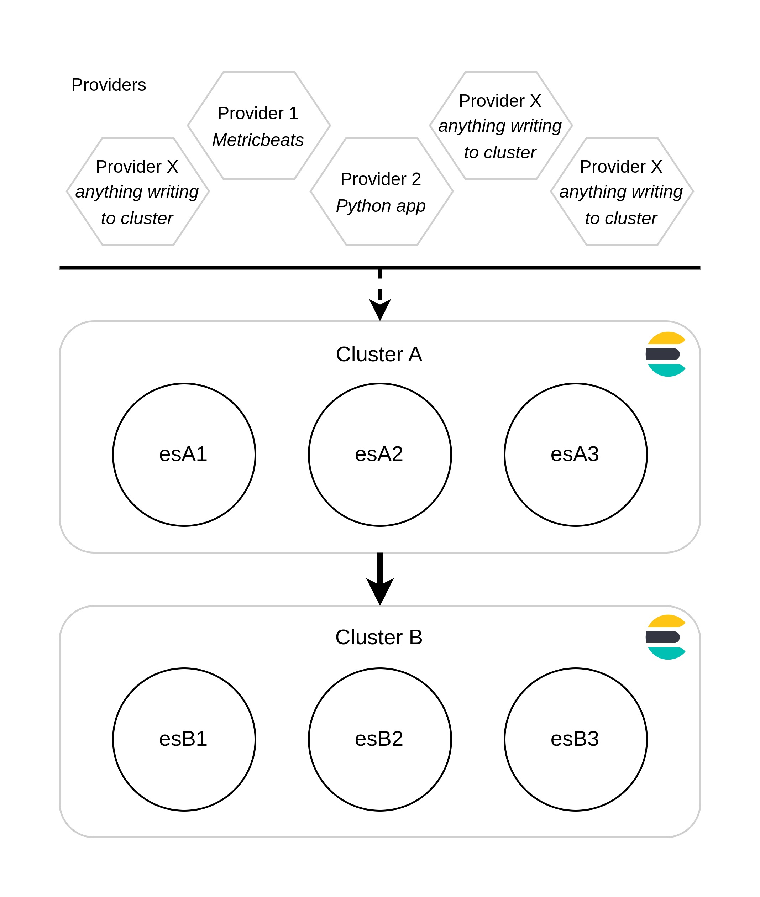

# Elasticsearch migration tutorial

The companion repo to my blogpost on migrating an Elasticsearch cluster without service disruption.



## Setting up the initial infrastructure

1. Configure your host's ulimits to be able to handle high I/O

    ```bash
    sudo sysctl -w vm.max_map_count=500000
    ```

2. Generate certificates and start Cluster A

    ```bash
    docker-compose -f create-certs.yml run --rm create_certs
    docker-compose -f clusterA.docker-compose.yml up -d
    ```

## Add data and benchmark Cluster B
